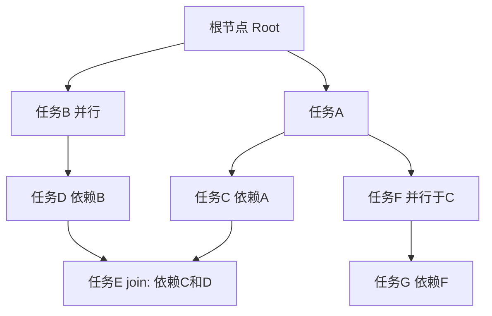

# 会话任务 DAG 卡片 —— 项目需求设计文档（定稿版）

> 版本：v1.0（吸收两轮评审意见，项目立项定稿）
> 状态：需求定稿，可进入 M2 前端原型开发
> 关联决策（已与需求方确认）：
> - 并行节点**真并行执行**，且**共享会话上下文（增量版本化）**
> - 数据结构为 **DAG，允许合并（join）**，不局限于纯树
> - 本阶段**只出设计方案**，暂不编码
> - 追加操作**仅由用户主动触发**，大模型不自动判断/创建 join

---

## 0. 文档导读（新增）

本文档是"会话任务 DAG 卡片"系统的**唯一需求设计源**。重点章节：

| 章节 | 核心内容 |
|------|----------|
| §1–§2 | 背景、目标、核心概念 |
| §3 | 数据结构（DAG 节点/边/追加规则） |
| §4 | 执行语义（并行、上下文读写、join、失败、文件隔离） |
| **§5** | **界面交互设计（前端重点，含 join 交互全流程）** |
| §6 | 后端接口草案 |
| §7 | 状态机 |
| §8 | 技术选型 |
| §9 | 评审决议与待办 |
| §10 | 里程碑 |

> 阅读建议：前端开发重点看 §5（布局/卡片/追加/join 交互）+ §3.4（追加规则）+ §7（状态机）；后端开发重点看 §3 + §4 + §6 + §7。

---

## 1. 需求背景与目标

### 1.1 背景
当前会话（session）内任务通常是一条线性链：一次对话对应一个任务，前一个任务结束后才能开始下一个。这带来两个问题：

1. 用户在一次会话中想**同时推进多个相互独立的任务**时，只能串行等待，效率低、体验割裂。
2. 会话内的任务关系（依赖、并行）没有可视化表达，用户难以看清"哪个任务依赖哪个"。

### 1.2 目标
- 在**一个会话内**支持任务**并行执行**：执行中可以插入并行任务，多个任务可同时运行。
- 用**卡片式流程图**展示整个会话的任务结构：每个对话/任务是**一个节点卡片**，节点可展开（详情）/ 收起（简略）。
- 任务之间支持三种基本关系：
  - **串行**：新任务依赖当前任务 → 在当前节点之后向下延伸。
  - **并行**：新任务独立于当前任务 → 与当前节点同层并排。
  - **合并（join）**：多个并行任务汇合成一个共同的下游任务（DAG）。
- 新建会话时只有一个起点（根节点），结构像一棵树/DAG 逐步生长出来。

### 1.3 非目标（本期不做）
- 不做跨会话的任务编排。
- 不做任务之间的数据流编辑器（本期只表达"执行顺序/依赖"，不编辑数据传递）。
- 不做任务的拖拽重排（可后续迭代）。

---

## 2. 核心概念与名词

| 名词 | 说明 |
|------|------|
| 会话（Session） | 一次新建会话，对应一棵 DAG 的承载容器，有唯一根节点 |
| 根节点（Root） | 会话起点，**唯一**。是占位节点，不含实际任务内容，仅作为拓扑起点 |
| 任务节点（Node） | 用户的**一次对话/一个任务**，即一张卡片。含任务输入、执行状态、输出 |
| 边（Edge） | 节点间的依赖/顺序关系：`父节点 → 子节点` |
| 串行追加 | 在选定节点**之后**追加子节点（选定节点成为其父节点） |
| 并行追加 | 在选定节点的**父节点**下追加兄弟节点（与选定节点同层） |
| join（合并） | 用户选择**多个**节点作为父节点，创建它们的**共同下游节点**；**不是**把多个卡片"揉成一个"，而是多条边汇聚到同一个新节点 |
| 展开 / 收起 | 卡片两种状态：展开显示任务详情，收起仅显示标题+状态 |

### 2.1 join 是什么（评审补强，用例子说明）

> join = **等多个并行任务都完成后，再基于它们各自的产出一起做下一步**。

例：任务 A（分析代码）、任务 B（查类似问题）并行跑；都完成后，任务 E（综合 A+B 写重构方案）作为它们的共同下游执行。E 的 `parentIds = [A, B]`，E 执行时能同时读到 A 与 B 已发布的产出。

- **谁决定 join**：**只有用户**。大模型不自动判断、系统也不自动创建 join 节点（v2+ 可让 agent 返回"合并建议"，但仍需用户确认）。
- **视觉含义**：A、B 卡片各自保持不变，只在它们下游多出一个新卡片 E，有两条边从 A、B 指向 E（"多条线汇到同一个节点 = 该节点需等前面全部完成"）。

---

## 3. 数据结构设计（DAG）

### 3.1 拓扑模型
- 一个会话 = 一个**有向无环图（DAG）**，有且仅有一个入度为 0 的根节点。
- 每个任务节点可有 1 个或多个父节点（join 场景），0 个或多个子节点。
- 边表示"执行依赖/顺序"：子节点开始执行前，所有父节点须**执行完成**（join 语义）或按依赖就绪。
- 全局约束：**不允许成环**（创建边时做环检测）。



### 3.2 节点模型（Node）

| 字段 | 类型 | 说明 |
|------|------|------|
| nodeId | string | 节点唯一 ID（会话内） |
| sessionId | string | 所属会话 |
| parentIds | string[] | 父节点 ID 列表（≥1；根节点为空） |
| title | string | 任务标题（简略信息主字段） |
| status | enum | 见 §7 状态机 |
| kind | enum | `root` / `task`（根节点 vs 任务节点） |
| input | object | 任务输入（用户给 agent 的原始对话/指令） |
| output | object | 任务输出，结构见 §3.2.1（分类型定义，供前端展开态渲染） |
| progress | object | 执行中间过程（步骤、日志、token、耗时等） |
| contextRef | string | 执行所基于的上下文版本引用（增量快照，见 §4.2.3） |
| collapsed | bool | 前端状态：是否收起（默认前端本地，见 §9 决议） |
| createdAt / updatedAt | datetime | 时间戳 |
| meta | object | 扩展字段（创建方式：串行/并行/join 等） |

#### 3.2.1 输出结构（output）——供前端展开态渲染

`output` 不是单一纯文本，按类型分结构，前端据此决定渲染方式。

```json
output: {
  "type": "text" | "code" | "files" | "mixed",
  "content": "纯文本/富文本" | Array<CodeBlock> | Array<FileRef>,
  "artifacts": [ArtifactRef],
  "summary": "一句话结论"
}
type CodeBlock = { lang: string; title?: string; code: string; }
type FileRef   = { path: string; content?: string; language?: string; }
type ArtifactRef = { id: string; name: string; url?: string; type?: string; size?: number; }
```

- `type=text` → 渲染为正文；`type=code` → 带高亮代码块/diff；`type=files` → 文件列表；`type=mixed` → 按段渲染。
- `artifacts` 用于关联测试报告、构建产物等，独立于正文展示。
- `summary` 供**收起态**卡片展示（不用展开即可获知结论）。

### 3.3 边模型（Edge）
边不单独建表，直接用节点 `parentIds` 表达拓扑；边类型由前端根据上下文推断展示，不单独落库（v1 降低复杂度）。

### 3.4 追加规则的确定性描述

用户在**任意节点 N** 上发起追加时，规则如下：

| 用户动作 | 新节点位置 | parentIds | 触发条件 |
|----------|-----------|-----------|----------|
| 串行追加（"在 N 之后"） | N 的子节点 | `[N]` | 无 |
| 并行追加（"与 N 并行"） | N 的父节点的子节点（N 的兄弟） | `[parent(N)]` | N 有父节点（根节点不可并行追加） |
| join 追加（"合并到 N1、N2 之后"） | N1、N2 的共同下游 | `[N1, N2, ...]` | 选择 ≥2 个节点；新边不构成环 |

> **评审 bug 修复**：`mode=parallel` 时请求体的 `parentIds` 必须是 `parent(anchorNodeId)`，**不是** `[anchorNodeId]`。详见 §6 请求示例。

边界规则：
- 根节点是占位节点，第一个真实任务只能作为根节点的**子节点**追加。
- 根节点无父节点，不能在根节点上做"并行追加"。
- 任何追加操作前校验：新边加入后 DAG 仍无环；有环则拒绝并提示。
- join 的父节点集合可为任意层级节点（不需同层），只要不产生环。

---

## 4. 执行语义

### 4.1 并行执行
- 并行分支（同层兄弟、不同分支）的节点**真并发执行**：各自独立跑一个 agent 任务，互不阻塞。
- 串行链（父子）保持顺序：子节点在所有父节点到达终态后进入"就绪 → 执行"。
- 会话执行模型采用**依赖驱动（DAG 调度）**：节点 `pending`，当所有父节点进入终态（`done`/`failed`/`cancelled`）后进入 `ready`（join 部分失败策略见 §4.2.5）；调度器从 `ready` 队列并发取节点执行，**并发上限默认 5（per-session，可配置）**。

### 4.2 共享会话上下文（读/写模型）

#### 4.2.1 读模型（明确、可预测、无竞态）
- 每个节点执行时只读两部分：(1) 启动时会话上下文快照；(2) 所有已进入终态的父节点发布的产出。
- **不读**正在运行的兄弟节点、未完成父节点的任何内容。

| 场景 | 能否读到 |
|------|----------|
| A、B 并行，A 执行时读 B 的中间产出 | **否**（B 未终态） |
| A 完成、B 仍在跑，C（依赖 A）执行时读 B 产出 | **否**（B 未终态） |
| A 完成后，C（依赖 A）执行时读 A 产出 | **是**（A 已终态并发布） |
| join 节点读所有父节点产出 | **是**（所有父均终态后才就绪） |

#### 4.2.2 写模型与冲突合并
- 会话维护一份**共享上下文**（会话级记忆、全局变量/产物引用、用户偏好等）。
- 节点基于启动快照开始，写入以"键值追加/更新"方式**发布**；只有节点**主动发布**的产出进入共享上下文，私有中间状态只属该节点（`progress`）。
- **冲突合并策略（v1 默认）**：同键并发写入 → 置为**冲突态**，由用户裁决（保留 A / 保留 B / 合并），裁决前下游节点不自动消费该键。

#### 4.2.3 增量快照（存储成本控制）
- 快照 = `parentVersionId + 本节点写入的键值集合`；读取时沿父链回溯组装完整视图。
- 增量累计到阈值（如 N 版本）或 join/分支汇合时做一次**全量基线快照**，控制回放代价与存储增长。
- `contextRef` 记该增量链的锚点版本号。
- **回溯深度上限**：超过 N（如 20）层时，自动在最近第 N 层做全量基线，后续从该基线增量。

#### 4.2.4 执行层文件隔离（并行冲突兜底）
- 每个并行执行节点分配**隔离工作目录/工作区**：git 场景用 **git worktree**（每节点独立），执行完再 merge；非 git 用独立目录 + 提交时合并。
- 节点间共享文件只通过"已发布的产物引用"传递（§4.2.1 读模型），不直接互改同一文件；合并冲突走用户裁决（§4.2.2）。

#### 4.2.5 join 部分失败默认策略（v1 定死）
- join 下游节点**等待所有父节点进入终态**（`done`/`failed`/`cancelled`）后结算：
  - 全部 `done` → 下游正常进入 `ready` 执行。
  - 任一 `failed`/`cancelled` → 下游进入 **`blocked`**（不是 `failed`）。
- `blocked` 由用户选择："跳过失败继续"（取其余成功父产出）或"整体取消"（下游置 `cancelled`）。

#### 4.2.6 取消/失败/超时语义（评审补强）
- 某并行节点失败**不自动取消**其他并行/兄弟节点；下游取消/延误仅由 §4.2.5 join 结算与用户操作决定。
- 支持对单个 `running` 节点发取消，置为 `cancelled`。
- **超时**：节点 `running` 超过 `timeout`（默认 10 分钟，可配置）自动置 `failed(timeout)`，触发 join 结算（走 §4.2.5）。
- **重试**：failed 节点用户点"重试" → 创建一个**新节点**（新 nodeId，`parentIds` 同原节点），原节点保持 `failed` 不动，DAG 历史完整可追溯。

### 4.3 执行示例
```
会话开始 → 根节点创建
  ├─ 任务A（并行1）开始执行 ──────────────── 完成
  ├─ 任务B（并行2）开始执行 ──── 完成
  └─ 任务C 依赖A → A完成后执行 ── 完成
任务D（join：依赖C和B）→ C、B 都完成后执行
```

---

## 5. 界面交互设计（前端重点）

### 5.1 布局与画布
- 画布为**自上而下**的树/DAG 视图：根节点在最顶部，任务节点向下生长，并行分支横向排开。
- 布局引擎建议 `@dagrejs/dagre` 或 `elkjs`（DAG 自动布局 + 连线）。
- 支持：画布平移、缩放；连线用箭头表示依赖方向。
- **根节点渲染（评审决议）**：采用**轻量形态**（圆形节点或一行横线 + "会话起点"），不占与普通任务卡片同等的视觉空间；语义保持占位节点不变。

#### 5.1.1 大图渲染策略（节点 50+/100+）
| 策略 | 做法 |
|------|------|
| 视口裁剪 | 只渲染可视区域内的卡片与连线，不可见节点仅占位，滚动/缩放按需加载 |
| 折叠子树 | 节点提供"折叠"操作，将下游整棵折叠成占位（显示"N 个子任务"），点击展开局部 |
| 搜索/过滤 | 按状态、关键词、是否运行中过滤，未命中节点从画布淡出 |
| 布局分级 | 节点多时按 join/分支层级聚合，仅首屏铺满可见层，其余折叠 |

> 目标：单画布承载 100+ 节点仍可流畅平移缩放、可读。

### 5.2 卡片两种状态
| 状态 | 显示内容 | 说明 |
|------|----------|------|
| 收起（默认） | 标题、状态徽标、子节点数、耗时、output.summary | 一屏看全貌 |
| 展开 | 任务输入、执行过程（步骤/日志/中间产物）、最终输出、上下文版本、操作按钮 | 详情 |

**交互（评审冲突修复）**：
- **点击卡片空白处 = 设为追加锚点**（卡片高亮描边），**不展开**。
- **双击卡片 / 点卡片右上角"展开"图标 = 展开/收起切换**。
- 这样"选锚点"与"读详情"两个动作无歧义。
- 展开态卡片内容区自适应高度、内部可滚动。
- 状态颜色：执行中（蓝/呼吸动效）、完成（绿）、失败（红）、等待就绪（灰）、阻塞（黄）。

### 5.3 追加操作（核心交互）

#### 5.3.1 追加入口 —— 独立全局输入区
> **不在正在流式输出的卡片里嵌输入区**（避免干扰阅读）。追加是独立入口，与卡片内容展示解耦。

- 画布**顶部固定一条全局追加栏**：`[锚点选择] | 输入新任务指令 | [模式: ○串行 ○并行 ○合并]`。
- **锚点选择器**：用户点击画布任意节点卡片将其设为锚点，卡片高亮描边。
- 追加操作**不打断**正在流式输出的卡片：流式照常继续，追加只是创建新节点（`pending`），互不影响。
- 卡片上的"+"按钮是"设为锚点"快捷入口，不承载输入框实体。

```
│ 画布顶部全局追加栏                                                │
│ [锚点:B ▲] [锚点多选(join): B,C] [输入新任务指令............] [○串行 ○并行 ○合并] [＋] │
└────────────────────────────────────────────────────────────────────┘
     ┌─────────┐   ┌─────────┐
     │   A      │   │  B(锚点)│   ← 卡片只展示，不内嵌输入区
     └─────────┘   └─────────┘
```

#### 5.3.2 三种追加模式

| 模式 | 锚点 | 新节点位置 | parentIds |
|------|------|-----------|-----------|
| 串行追加 | 单选 N | N 的子节点 | `[N]` |
| 并行追加 | 单选 N | N 的兄弟（挂 parent(N) 下） | `[parent(N)]` |
| 合并追加（join） | 多选 N1..Nk（k≥2） | 共同下游节点 | `[N1..Nk]` |
| 根节点追加 | 根节点 | 第一个子任务（语义等同串行） | 根节点 |

交互细节：
- 并行追加要求锚点 N 有父节点（根不可做并行锚点），否则禁用并提示。
- join 进入多选模式后点击 ≥2 个节点为父节点，输入内容 → 创建共同下游；连线从各父汇入。
- 输入确认后新节点立即以 `pending` 出现，父节点满足条件后自动执行（流式节点不阻塞追加）。

### 5.4 join 交互全流程（前端重点，评审补强）

用户创建 join 节点的完整操作与渲染：

**Step 1 — 已有并行节点**：
```
┌──────────┐      ┌──────────┐
│  任务A    │      │  任务B    │
│ ✅ done   │      │ ✅ done   │
└──────────┘      └──────────┘
```

**Step 2 — 用户发起 join**：点击 A（A 高亮描边=锚点1）→ 点顶部"多选/join" → 点击 B（B 高亮描边=锚点2）→ 顶部栏显示 `合并 A,B → 新任务`，模式切为"合并"。

**Step 3 — 确认创建**：输入"综合两份结果写重构方案" → 点"＋"。新节点 E 出现，有两条边 A→E、B→E：
```
┌──────────┐      ┌──────────┐
│  任务A    │      │  任务B    │
│ ✅ done   │      │ ✅ done   │
└────┬─────┘      └────┬─────┘
     │                  │
     └──────┬───────────┘
            ▼
     ┌──────────┐
     │  任务E    │  ← 新卡片，pending → ready → running
     │ 🔵 等待   │
     └──────────┘
```
- A、B 卡片**完全不变**（不被融合/吃掉）；两条边为实线箭头表示依赖。
- E 因 A、B 均 done，直接进 `ready` → 立即执行。

**Step 4 — E 执行中**：E 流式输出，能读到 A+B 的综合产出（走 §4.2.1 读模型）。

> 布局引擎（dagre/elkjs）会自动把 A、B 放同层横向并排，E 放下一层居中，两条边画成贝塞尔/直角折线。

### 5.5 会话生命周期
1. 用户"新建会话" → 创建根节点卡片（轻量占位，显示"会话起点"）。
2. 在根节点下创建第一个任务 → DAG 开始生长。
3. 之后每个对话在界面选择追加位置，生成新卡片与连线。
4. 会话内所有节点执行完毕（或用户终止）→ 会话结束，DAG 保留可回看。

---

## 6. 后端接口草案（v1）

> 查询走 REST，执行状态走 WebSocket/SSE 推送。

| 方法 | 路径 | 说明 |
|------|------|------|
| POST | `/api/sessions` | 新建会话，返回根节点 |
| GET | `/api/sessions/{id}/graph` | 获取整个 DAG（节点+边，含状态） |
| POST | `/api/sessions/{id}/nodes` | 追加节点（body: `{mode, anchorNodeId, parentIds, input}`），后端做环检测 |
| GET | `/api/nodes/{nodeId}` | 获取节点详情（progress/output） |
| PATCH | `/api/nodes/{nodeId}` | 更新节点（标题、collapsed 等） |
| POST | `/api/nodes/{nodeId}/cancel` | 取消执行 |
| POST | `/api/nodes/{nodeId}/retry` | 重试（创建新节点，见 §4.2.6） |
| WS | `/ws/sessions/{id}` | 推送：节点状态变更、progress 增量、上下文版本变更 |

**创建节点请求示例（评审 bug 修复版）**：
```json
POST /api/sessions/{id}/nodes
{
  "mode": "parallel",
  "anchorNodeId": "node-A",
  "parentIds": ["parent-of-node-A"],
  "input": { "text": "帮我并行调研竞品B的价格策略" }
}
```
> `mode=parallel` 时 `parentIds = [parent(anchorNodeId)]`（**不是** `[anchorNodeId]`）。`mode=join` 时 `parentIds` 为显式多父节点列表（≥2）。

**后端校验要点**：
- `mode=parallel` → `parentIds = parent(anchor)`；根节点拒绝。
- `mode=join` → `parentIds.length ≥ 2`。
- 新边成环 → 400。
- 锚点已执行完 → 新节点直接 `ready`；锚点执行中 → 新节点 `pending` 等待。
- **环检测性能**：常规追加走拓扑排序缓存，仅增量检查新边涉及路径；仅 join 多父破坏缓存时才全量重排。目标：200+ 节点追加毫秒级返回。
- **WS 断线重连**：连接成功后前端带 `lastEventId`，后端补推断线期间事件；或前端 `GET /graph` 全量刷新兜底。

---

## 7. 状态机

```
pending(等待) ──父节点全部到达终态──▶ ready(就绪) ──调度──▶ running(执行中)
running ──成功──▶ done(完成)
running ──失败──▶ failed(失败)
running ──超时──▶ failed(timeout)
running ──用户取消──▶ cancelled(已取消)
running ──暂停──▶ paused(暂停) ──恢复──▶ running
ready/待结算 ──join任一父失败──▶ blocked(阻塞,由用户选择) ──跳过失败继续──▶ ready
                                                   └──整体取消──▶ cancelled
```

- `pending → ready`：所有父节点终态；join 按 §4.2.5 结算。
- 某父 `failed` → join 下游 `blocked`（非自动 `failed`），由用户决定。
- 并行节点互相独立，任一失败不阻塞兄弟。

---

## 8. 技术选型建议（仅建议，待评审）

| 层 | 建议 |
|----|------|
| 前端 | React + TypeScript + Vite；DAG 布局用 `@dagrejs/dagre` 或 `elkjs`；连线用 SVG |
| 前端状态 | zustand（画布/卡片/锚点选择状态）；卡片级展开存 localStorage，子树折叠存后端（§9 决议） |
| 后端 | 沿用现有会话服务技术栈；调度器用队列 + worker 并发池（per-session 并发上限 5） |
| 存储 | 会话/节点/边持久化；共享上下文存 Redis（增量版本化键值）；并行节点工作区用独立目录 / git worktree 隔离 |
| 实时 | WebSocket 推送节点状态；支持 SSE 作为降级 |

---

## 9. 评审决议（两轮评审汇总）

### 9.1 已定默认（不再需要拍板）
1. 并发上限默认 **5**（per-session，可配置）——§4.1。
2. 上下文冲突合并：同键并发写入置**冲突态**，用户裁决 ——§4.2.2。
3. join 失败传播：下游 **`blocked`**，用户选"跳过失败继续/整体取消" ——§4.2.5。
4. 并行读模型：只读"启动快照 + 已终态父产出" ——§4.2.1。
5. 执行层文件隔离：每并行节点独立 worktree/目录 ——§4.2.4。
6. 上下文存储：增量快照 + 回溯深度上限自动全量基线 ——§4.2.3。
7. 节点超时默认 10 分钟 + 重试创建新节点 ——§4.2.6。
8. join 仅由用户触发，大模型不自动判断/创建 ——§2.1。

### 9.2 本轮待确认项的决议（评审采纳建议）
9. **根节点形态**：维持占位节点，但**前端渲染为轻量形态**（圆形/横线），不占普通卡片同等空间 ——§5.1。
10. **收起/展开状态**：卡片级展开/收起存**前端 localStorage**；**子树级折叠**（影响全局布局）存**后端** ——§5.1.1。

### 9.3 仍需用户拍板（如有偏离请指出）
- 无阻塞性待确认项；文档可定稿进入 M2。

---

## 10. 里程碑建议

| 阶段 | 内容 | 产出 |
|------|------|------|
| M1 | 需求文档评审定稿 | 本文档 v1.0 |
| M2 | 前端静态原型 | 卡片/DAG 渲染、展开收起、追加交互（串行/并行/join）、mock 数据 |
| M3 | 后端数据模型 + 接口 | 会话/节点/边 CRUD、环检测、WS 推送、重试/取消 |
| M4 | 执行调度打通 | DAG 调度、并行执行、共享上下文版本化、worktree 隔离 |
| M5 | 联调与体验优化 | 并发控制、失败/超时/blocked 处理、大图渲染、WS 重连 |

---

## 附录 A：前端组件拆分建议（M2 参考）

| 组件 | 职责 |
|------|------|
| `FlowCanvas` | React Flow / dagre 画布容器，管理节点/边数据、缩放/平移 |
| `TaskNode` | 卡片节点（收起/展开两态、状态色、锚点高亮、双击展开） |
| `GlobalAppendBar` | 顶部全局追加栏（锚点显示、模式切换、输入、提交） |
| `NodeDetailDrawer` | 展开态详情（输入/日志/输出/artifacts） |
| `JoinMultiPicker` | join 多选锚点控制器 |
| `DagFilterBar` | 状态/关键词搜索过滤 |

## 附录 B：一键可跑的验证清单（M2 原型）
1. 新建会话 → 根节点（轻量）出现。
2. 根下串行追加 2 个任务 → 两条纵向边。
3. 同一父下并行追加 → 两节点横向并排。
4. 选 ≥2 节点 → join 追加 → 新节点有 ≥2 条入边，父均 done 后自动 ready。
5. 父之一 failed → join 下游 `blocked`，可"跳过失败/取消"。
6. 100+ 节点 mock → 视口裁剪/折叠/搜索可用、画布流畅。
